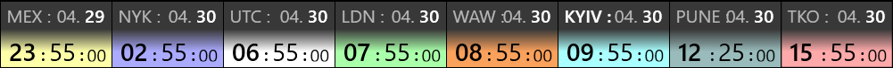
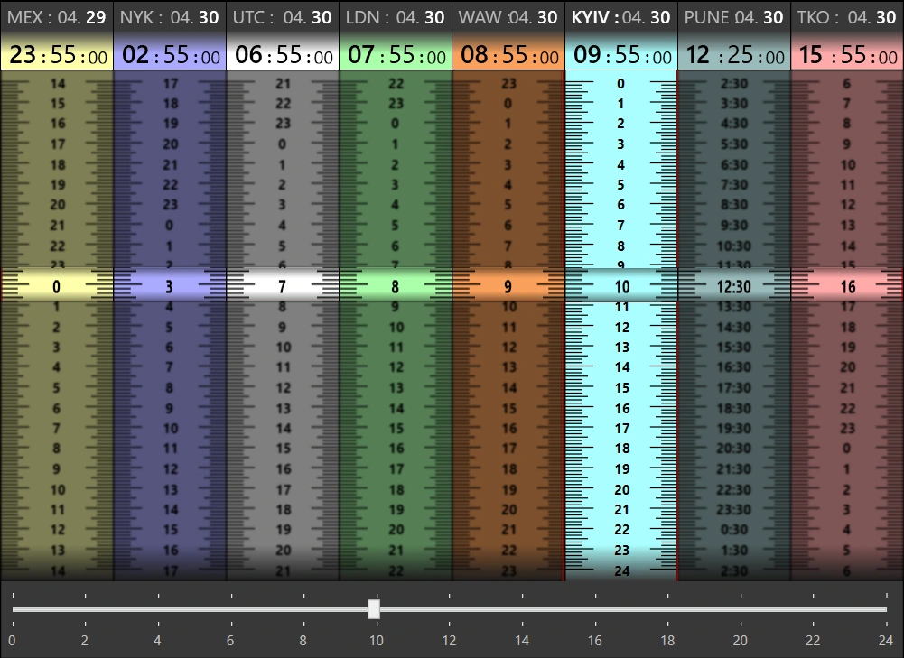

# Ozi.Clock
Compact Clock with different Time Zones
# 🌍 WPF World Clock

A compact and customizable **WPF desktop Clock** displaying current time in multiple time zones. This app is designed to always stay on top, with a transparent mode and adjustable UI for easy time comparison across global cities.

---

## 🧩 Features

- ⏱️ Displays current time in multiple time zones:
    - NYK (New York)
    - LDN (London)
    - KYIV (Kyiv)
    - PUN (Pune)
    - SGP (Singapore)
    - TKO (Tokyo)
    - and other
- 🎛️ Sliders to shift time and compare different zones.
- 📐 Compact view for minimal screen space usage.
- 🪟 "Always on top" mode.
- ✨ Optional transparent window mode.
- 🎨 Color-coded zones for easy recognition.

---

## 📸 Screenshots

### Compact Mode

### Standard Mode

### Extended Mode

---
## Getting Run

1. Go to the Releases section https://github.com/ozinka/OziClock/releases
2. If you have installed .Net 9 version or higher download `oziclock.xxx.win-x64.zip`, otherwise `oziclock.xxx.win-x64-bundled.zip`. Last one contains all required .Net files.
3. Unzip and run `OziClock.exe` file.

p.s. As this is Open Source and Free project, it doesn't have certificate :(. Therefore, you may receive warning massage about unknown source of this application. There are two options:
* ignore this message (will be shown only once)
* Build the app by your own

## 🚀 Getting Started

1. Clone the repository
2. Open the solution in Visual Studio
3. Install .Net 9
3. Build and run the project

---

## 🛠️ Technologies

- C#
- WPF (Windows Presentation Foundation)
- .Net 9.0

---

## 📌 Notes

- Designed for Windows OS.
- Optimized for developers or teams working across time zones.

---

## 📃 License

This project is licensed under the MIT License.
