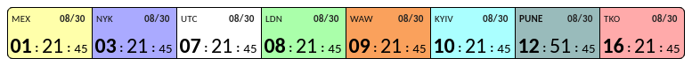
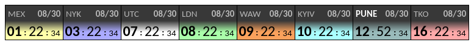
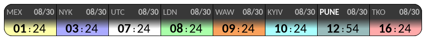
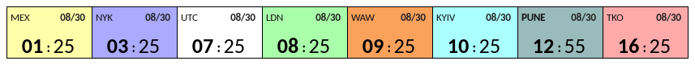
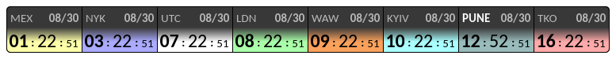
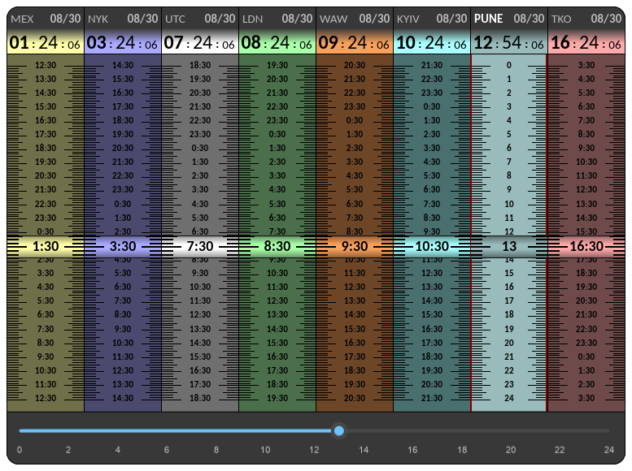
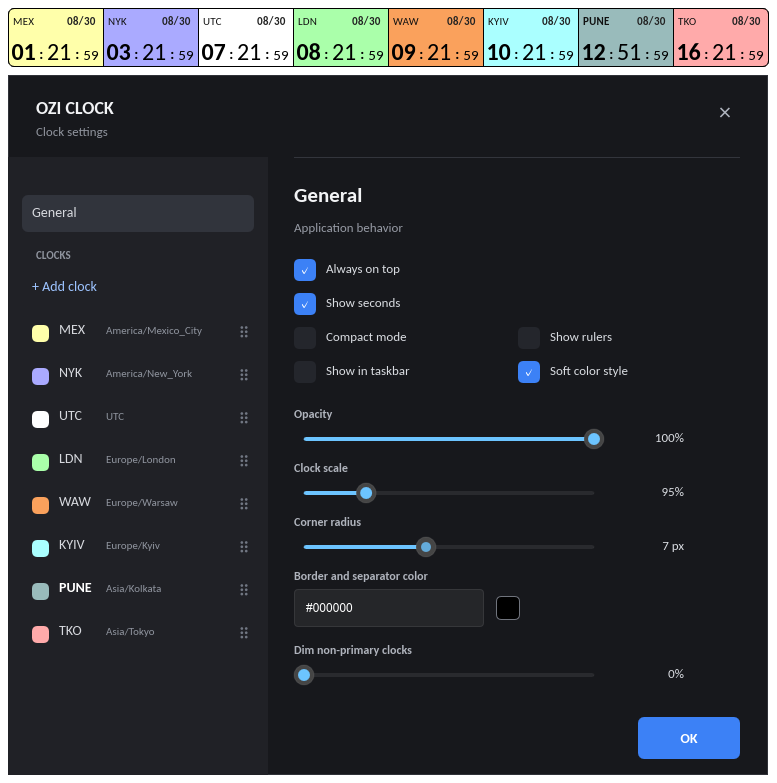
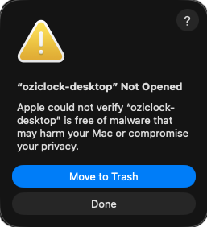
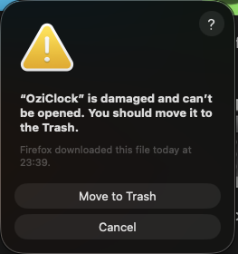

# OziClock

## Contents

- [About](#about)
- [Installation](#installation)
  - [Windows](#windows)
  - [macOS](#macos)
  - [Linux](#linux)
- [Documentation](#documentation)

## About

OziClock is a lightweight desktop world clock for viewing several time zones at once. Version 2 is a native Rust and Slint rewrite of the original WPF/.NET application.



## Features

- Multiple configurable world clocks using IANA time zones.
- Two visual styles, adjustable opacity and a transparent frameless window.
- Standard and compact layouts with independently controlled time rulers.
- Configurable scale, corner radius, border color, and separator color.
- Optional seconds and configurable dimming for non-primary clocks.
- Smooth transitions when changing layout or highlighting clocks.
- Draggable, always-on-top window, tray controls, and contextual actions.

## Appearance and Modes

### Classic and soft color styles

Choose between the classic style with a dark header and color gradient, and the cleaner soft color style. Both styles support the same clocks, layouts, scaling, and interaction modes.

| Classic style | Soft color style |
| --- | --- |
|  |  |

Seconds can be shown or hidden independently of the selected style.

| Classic style without seconds | Soft style without seconds |
| --- | --- |
|  |  |

### Compact layout and rounded corners

Compact mode keeps only the time row visible. The corner radius is configurable from square to fully rounded, and the area outside the clock remains transparent instead of becoming part of a rectangular window background.

| Standard, square corners | Standard, rounded corners |
| --- | --- |
|  |  |

| Compact, square corners | Compact, rounded corners |
| --- | --- |
|  |  |

### Primary clock focus

Non-primary clocks can be dimmed by up to 80% to make the selected location easier to find. Moving the pointer over the clock smoothly restores full brightness for every column.


### Time rulers

Ruler mode expands the same window to show a full 24-hour scale for every time zone. The horizontal control moves the shared time lens, making cross-zone comparisons easier. Compact mode and ruler visibility are independent controls.



### Settings

The settings window manages clocks and their order as well as always-on-top behavior, seconds, compact and ruler modes, taskbar visibility, style, opacity, scale, corner radius, border and separator color, and non-primary clock dimming.



## Installation

Download the current release from [GitHub Releases](https://github.com/ozinka/OziClock/releases/latest).

### Windows

1. Download the Windows x64 archive from the latest release.
2. Extract the archive to a folder where the application can keep its `settings.json` file.
3. Run `oziclock-desktop.exe`.

No installation, .NET runtime, or Visual C++ Redistributable is required. To launch OziClock automatically after signing in, create a shortcut to `oziclock-desktop.exe` in the Windows Startup folder.

### macOS

The macOS build supports Apple Silicon:

1. Download and extract the macOS archive.
2. Move `OziClock.app` to the **Applications** folder.
3. Open Terminal and run this command once:

   ```sh
   xattr -dr com.apple.quarantine /Applications/OziClock.app
   ```

4. Open `OziClock.app` from Applications.

The application uses a free ad-hoc code signature but is not signed with an Apple Developer ID or notarized. The command removes only the quarantine attribute that macOS adds to files downloaded from the Internet.

The repository also contains a Homebrew cask for use from a personal tap. See [Homebrew packaging](packaging/homebrew/README.md) for testing and publishing instructions.

| Gatekeeper cannot verify the application | macOS reports that the application is damaged |
| --- | --- |
|  |  |

### Linux

1. Download and extract the Linux x64 archive.
2. Open a terminal in the extracted directory.
3. Make the application executable if necessary:

   ```sh
   chmod +x oziclock-desktop
   ```

4. Launch it:

   ```sh
   ./oziclock-desktop
   ```

The application creates `settings.json` on first launch. It is stored beside the executable on Windows and Linux and under `~/Library/Application Support/OziClock` on macOS. A macOS settings file from an older release is migrated automatically if it is found beside `OziClock.app`.

The last legacy WPF/.NET release is [v1.0.10](https://github.com/ozinka/OziClock/releases/tag/v1.0.10). Its source is preserved in [`legacy/dotnet-wpf/`](legacy/dotnet-wpf/).

## Repository Layout

- `apps/oziclock-desktop/` — native Rust desktop executable.
- `crates/` — reusable Rust domain and application modules.
- `ui/` — shared Slint components and design tokens.
- `docs/` — requirements, architecture, design specifications, and decisions.
- `legacy/dotnet-wpf/` — preserved WPF/.NET 9 reference implementation, assets, solution, and release script.

## Documentation

- [Product and architecture notes](docs/PRODUCT_ARCHITECTURE.md)
- [Target modular architecture](docs/ARCHITECTURE.md)
- [Functional and quality requirements](docs/REQUIREMENTS.md)
- [Prioritized product backlog](docs/BACKLOG.md)
- [Ruler and magnifying-lens design](docs/RULER_LENS_DESIGN.md)
- [Future alarms, reminders, timers, and stopwatch](docs/FUTURE_FEATURES.md)
- [AI-assisted development workflow](docs/AI_DEVELOPMENT_WORKFLOW.md)
- [Minimal Windows development environment](docs/DEVELOPMENT_ENVIRONMENT.md)
- [Rust and Slint stack decision](docs/decisions/0002-rust-slint-stack.md)

The Rust toolchain is required to build the active workspace. The legacy application can still be built from `legacy/dotnet-wpf/` with the .NET 9 SDK.

## Build from Source

Install the Rust stable toolchain, then run from the repository root:

```powershell
cargo run -p oziclock-desktop
cargo build --release -p oziclock-desktop
```

Windows builds use a statically linked Visual C++ runtime, so the release executable does not depend on `VCRUNTIME140.dll`.
